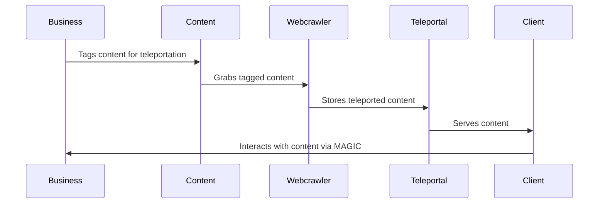
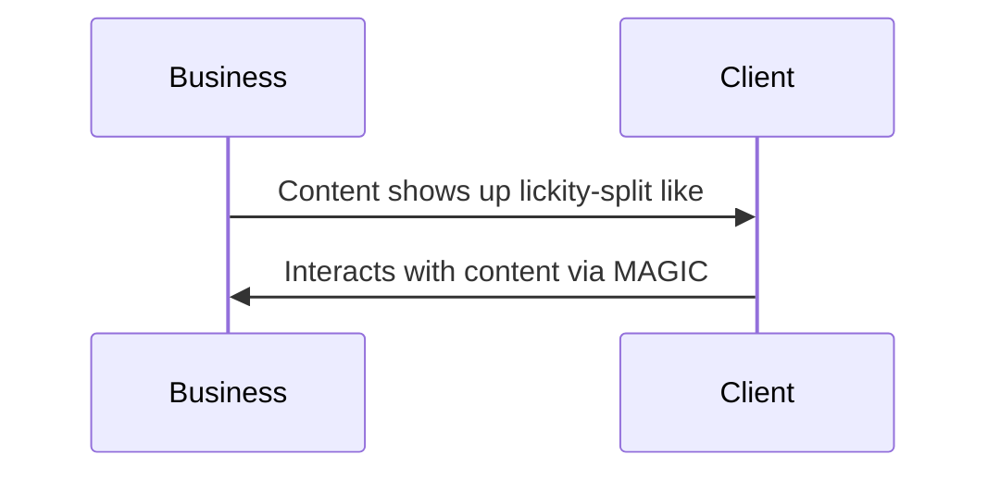

# Teleportation

*Teleportation* is a set of tools to allow for parts of larger client applications to be served from servers other than the main server of that application. 
I suppose technically this makes this more like duplication, but teleportation makes for a better namespace.

## Overview 

This repo builds on the stack that contains [Sessionless][Sessionless] and [MAGIC][MAGIC], and defines a protocol for tagging content on the web for teleportation, web crawlers to deploy to retrieve that content, and example server implementations for servers that persist and serve this content (known as teleportals). 
For a single business, and user the flow this enables is: business tags web content with teleportation tags -> web crawler "teleports" content to teleportal -> client requests relevant content from teleportal -> user interacts with content by casting a spell (see [MAGIC][MAGIC]) -> client does something when spell resolves.

Here is what that picture looks like:



Of course the middle steps only need to happen once, and they can happen before the client even shows up.
So to the _user_, the picture looks like:



And _that_ is the point of *Teleportation*.

## Use cases

In the above diagrams we use a business, but any cyberspace entity that wants interaction from users, or just wants to present information works.
With that in mind, consider the following use cases:

* Delivery Apps
* eCommerce of course
* Twitch Streaming 
* Job Searching
* Federated server searching
* Multiple context apps
* events and meetups
* activities
* classes
* restaurants

## Getting started

> **Note**: This repo is a work in progress.

The repo consists of two parts in the `src` directory.
The first is the protocol definition itself, along with examples of usage.
The second is teleportal implementations in various languages. 

```
├── src
│   ├── protocol
│   │   ├── definition
│   │   └── example
│   └── teleportal
│       └── javascript
|       └── other languages
```

As with other parts of the Stack, these implementations are persistence-layer agnostic, but we will be happy to add links to libraries making that easy for folks.

In general, all contributions will be enthusiastically embraced through a fork and pr.
The one exception is any proposed change to the protocol itself. 
That needs to be done carefully, and should go through a discussion on the repo itself.
If you have a suggestion for the protocol, but aren't sure if it's discussion worthy, head over to the [Open Source Force discord], and let @planetnineasaspaceship know.

### Protocol

Teleportation utilizes a custom html5 tag to wrap html content.
It looks like:

<teleport uuid=<UUID> signature=<Signature> spell=<spellName> taxons=<taxons> >
  <div>
    <p>Here is a paragrapgh</p>
  </div>
</teleport>

So before getting into the properties of the teleport tag, it might be worth reviewing [Sessionless][Sessionless] and [Magic].
I'll provide the concepts used here in a footnote[^1] as well.

So the teleport tag provides a UUID, and a signature of UUID + spellName to verify authenticity.
It also provides an optional spell, which is what client applications can use for interaction. 
And an optional list of taxons that teleportals can use to construct taxonomy of items.

Since HTML is just text when it's not being rendered, we can reduce this down to a very simple data model:

```javascript
{
  uuid: String,
  signature: String,
  spell: String?,
  taxons: String[]?,
  html: String 
}
```

Since this 4-tuple need not be part of a website, implementers can set up additional APIs for adding these objects beyond the web crawling strategy.
Depending on when you come across this repo, there might be examples of these APIs, but they're not the priority for us now.

### Teleportal

A teleportal is composed of three parts. 

1. a web crawler to go crawling for tags
2. a database to store the teleported entities in
3. a server to connect those two, and clients

Building a web crawler from scratch is outside of the scope of this repo, but implementing ones that exist to go to sites looking for teleport tags is in scope.

This repo will probably grow to include database integrations, but they're lower priority to getting servers up and running.

The goal of the server implementations are to be as plug and play as possible for people who just want to play around with the protocol. 

There is an infrastructural component to getting these points up and running, which we may build towards, but is out of scope for right now.

Teleportals can act as resolvers, but they don't have to. 
They can and should be part of the spells that get cast by their users. 
Refer to the [MAGIC][MAGIC] repo for how that works.

## Contributing

To add to this repo, feel free to make a [pull request][pr].

[Sessionless]: https://www.github.com/planet-nine-app/sessionless
[MAGIC]: https://www.github.com/planet-nine-app/MAGIC
[pr]: https://github.com/planet-nine-app/sessionless/pulls

[^1]: So Sessionless provides a protocol for public key authentication of signed messages across networked devices.
A typical implementation will grant a user a uuid, and that user will provide a public key to associate with that uuid, which is then used to verify signatures.

MAGIC introduces two concepts on top of Sessionless. 
The first is that of a "spell". 
The spell protocol allows multiple devices to combine authenticated messages together.

The second is that of a "resolver". 
A resolver is a server which holds the public keys and uuids of the participants in the spell, and can verify all of the combined signatures.
